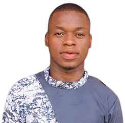
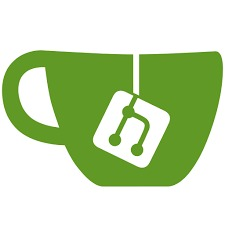
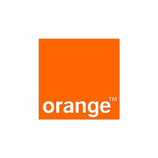
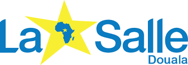
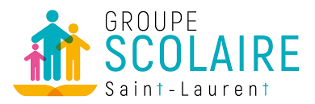

<html lang="fr">

<head>
    <title>CV Styve NEMATCHA</title>
    <meta charset="utf-8">
    <meta name="viewport" content="width=device-width, initial-scale=1, user-scalable=no">
    <link rel="stylesheet" href="cv.css">
    <link href="img/favicon1.png" rel="icon">
    <link href="img/apple-touch-icon1.png" rel="apple-touch-icon">
</head>

<body>
    <header>
        <h1>CV Styve NEMATCHA</h1>
    </header>

    <section>
        

            
        

        

            <h2>Qui suis-je ?</h2>
            
Etudiant en Bachelor1 Expert Informatique et me prépare pour un BTS Services Informatiques aux Organisations spécialité Solutions d'Infrastructures Systèmes et Réseaux. Je suis passionné des TI et de sécurités informatiques. J’aime le travail d’équipe et apprécie le contact client. Les challenges professionnels garantissent ma motivation et mon énergie en entreprise. Mon aisance orale me permet de m’adapter à mon public.
            

            <a href="https://drive.google.com/file/d/1CWskl-RSP2mR-r1thNMMDkHQ0cEfi5Ze/view?usp=sharing" download>Télécharger mon CV</a>
        

        

            <h2>Informations de contact</h2>
            

                
Nom : 

                
NEMATCHA Styve Christopher 

            

            

                
Adresse : 

                
2 rue Edmond Dantès - 78280 Guyancourt, France

            

            

                
Téléphone :

                
07 76 01 75 17

            

            

                
Mail : 

                
<a href="mailto:nematchastyve@mail.com">nematchastyve@mail.com</a>

            

            

                
                
                
                
                
            

        

    </section>

    <section>
        <h2>Expériences professionnelles</h2>
        

            

                
            

            

                <h3>Techinicien Support IT</h3>
                <h4>World Voice Group</h4>
                <h4>Février 2020 - Août 2021</h4>
            

            

                
Monter, installer et mettre en service les nouveaux matériels informatiques. Former les utilisateurs. Intervenir en assistance et réparation. Ordonnancer le déroulement des travaux. Réaliser les archivages et les sauvegardes des données.
                    Suivre et mettre à jour l'information technique, économique et réglementaire. Diagnostiquer les défaillances et proposer des solutions d'amélioration Assurer un soutien technique au service commercial Suivre l'état des stocks
                

            

        

        

            

                
            

            

                <h3>Stagiaire Administrateur Système et Réseau</h3>
                <h4>Orange Cameroun</h4>
                <h4>Octobre 2019 - Janvier 2020</h4>
            

            

                
Installation des postes informatiques dans l'entreprise et le support. La gestion du parc informatique. L'installation des logiciels et leur mise à jour. La sécurité Réaliser une veille technique constante pour proposer les meilleures
                    solutions. Faire évoluer le système pour le rendre toujours plus efficace et sûr. Maintenance du Parc Informatique, Assistance Utilisateurs Câblage, Configuration matériel administrable, suivre l'implantation des équipements, Formaliser
                    les besoins des utilisateurs pour améliorer le système.
                

            

        

        

            

                
            

            

                <h3>Superviseur des Ventes</h3>
                <h4>Orange Cameroun</h4>
                <h4>Août 2016 - Octobre 2019</h4>
            

            

                
Encadrer son équipe de commercial. Prendre en charge de leur recruter, de leur former et de leur accompagner. Fixe un objectif individuel pour chaque commercial et met en place un système afin récompenser financièrement ou physiquement
                    dans le but de motiver chaque commercial.
                

            

        

    </section>

    <section>
        <h2>Formation</h2>
        

            

                
            

            

                <h3>Bac +1 Expert Informatique & Systèmes Informatiques</h3>
                <h4>2021 - 2022</h4>
            

            

                
formation généraliste et théorique qui permet d'acquérir une solide culture informatique dans de nombreux domaines (algorithme, programmation, logique, algèbre) ainsi que des connaissances pratiques.

            

        

        

            

                
            

            

                <h3>BTS en Système & réseau</h3>
                <h4>2017 - 2019</h4>
            

            

                
spécialiste des environnements informatiques. Il participe à la production et à la fourniture de services en réalisant ou en adaptant des solutions d'infrastructure et en assurant le fonctionnement optimal des équipements.

            

        

        

            

                
            

            

                <h3>BTS en Physique Et Application</h3>
                <h4>2014 - 2016</h4>
            

            

                
Acquisition d’une double compétence en physique générale et en physique appliquée et instrumentale. Découverte du monde de l’entreprise grâce à un stage en entreprise au semestre 6. Possibilité d’intégrer différents masters professionnels
                    et écoles d’ingénieurs (IMT, Polytech…).
                

            

        

        

            

                
            

            

                <h3>Bac S option Maths</h3>
                <h4>2011 - 2014</h4>
            

            

                <!--
blablabla
-->
            

        

    </section>

    <section>
        <h2>Compétences</h2>
        <h3 class="h3gauche">Professionnelles</h3>
        

            
Administration Réseaux et système

            

        

        

            
Support & Maintenance Informatique

            

        

        

            
HTML / CSS

            

        

        

            
PHP / MySQL

            

        

        

            
Golang

            

        

        

            
JavaScript

            

        

        

            
Word / Excel / PowerPoint - 365

            

        

        <h3 class="h3gauche">Personnelles</h3>
        

            
Ethique & curieux

            
95%

            

        

        

            
Créativité

            
95%

            

        

        

            
Travail d’équipe 

            
95%

            

        

        

            
Adaptabilité

            
100%

            

        

    </section>

    <section>
        <h2>Centres d'intérêt</h2>
        <figure class="interet">
            
            <figcaption>Football</figcaption>
        </figure>
        <figure class="interet">
            
            <figcaption>Cuisine</figcaption>
        </figure>
        <figure class="interet">
            
            <figcaption>Jeux vidéos</figcaption>
        </figure>
        <figure class="interet">
            
            <figcaption>Littérature</figcaption>
        </figure>
        <figure class="interet">
            
            <figcaption>Musique</figcaption>
        </figure>
    </section>
    <footer>
        
<a href="https://nemsstyve.github.io/nemsstyve/">©Styve NEMATCHA</a> 2022

        <!--
Reproduction à des fins commerciales interdite.
-->
        <!--
Merci de respecter le travail des auteurs en faisant un lien vers le contenu original !
-->
    </footer>
</body>

</html>
